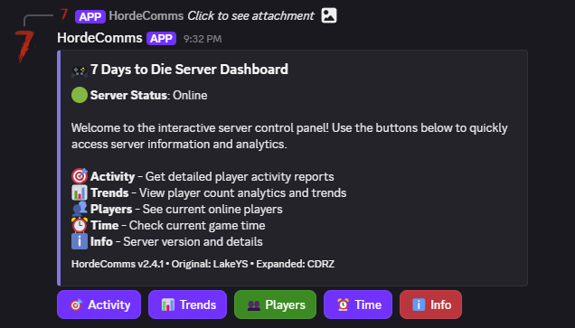
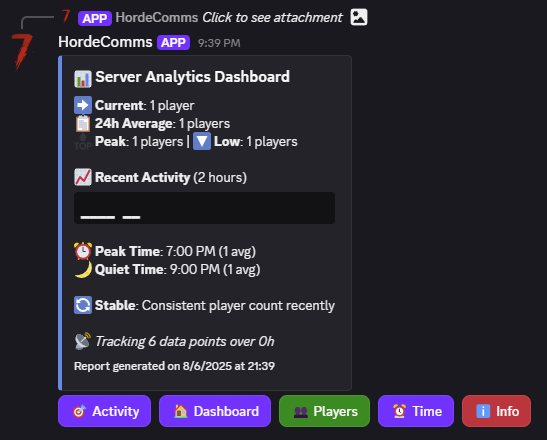

# HordeComms

HordeComms is an advanced Discord bridge bot for 7 Days to Die, built on the solid foundation of LakeYS's Dishorde with comprehensive enhancements. This version features an interactive dashboard, player analytics, intelligent activity tracking, and enhanced security features.

**Based on Dishorde by LakeYS** | [Original Dishorde](https://github.com/LakeYS/Dishorde) | [HordeComms Repository](https://github.com/thecdrz/HordeComms)
------------ | ------------- | -------------

## 🚀 **NEW FEATURES in HordeComms:**
- 🎮 **Interactive Dashboard**: Modern GUI with clickable buttons for all functions
- 📊 **Player Trends Analytics**: 24-hour tracking with enhanced visual charts and peak time analysis
- 🎯 **Dynamic Narrative Engine**: Intelligent storytelling with humor, time-aware scenarios, and contextual atmosphere ⭐ **NEW in v2.5.0!**
- 🎭 **Enhanced Empty Server Stories**: Witty narratives with time-specific scenarios and player history ⭐ **NEW in v2.5.0!**
- 🏃 **Multi-Scenario Support**: Specialized narratives for 0, 1, or multiple players with group dynamics ⭐ **NEW in v2.5.0!**
- 🔒 **Enhanced Security**: Environment variable support for credential protection
- 🌙 **Blood Moon Integration**: Contextual warnings and preparation advice
- 📱 **Rich Discord Embeds**: Professional formatting with organized sections
- 🧠 **Smart Biome Detection**: Location-aware storytelling with environmental context
- 📈 **Enhanced Chart Display**: Contextual player count visualization with trend indicators
- 🚪 **Enhanced Player Messages**: Rich embeds for join/leave/death events with contextual descriptions

HordeComms runs as a completely separate application, so no mods are required. **Dedicated servers on PC only.**

## 🎮 Commands

- `7d!dashboard` - Interactive GUI with clickable buttons ⭐ **NEW!**
- `7d!activity` - Dynamic narrative reports with humor and intelligent storytelling ⭐ **ENHANCED in v2.5.0!**
- `7d!trends` - Player count analytics with visual charts ⭐ **NEW!**
- `7d!players` - Current online players
- `7d!time` - Current game time
- `7d!info` - Complete feature overview and server information ⭐ **ENHANCED!**

💡 **Pro Tip**: Use `7d!dashboard` for the best experience - click buttons instead of typing commands!

## 📸 Screenshots

### Interactive Dashboard

*Clean, intuitive interface with clickable buttons for all server functions*

### Comprehensive Information Display

*Detailed feature overview with organized sections and professional formatting*

### Analytics & Trends

*Real-time player analytics with trend tracking and visual data representation*

# How it Works
HordeComms works by connecting to your server's telnet console and monitoring it for chat messages and player data. Messages are relayed to and from the server using Discord, allowing for seamless communication between in-game players and Discord users, plus comprehensive server analytics.

# Enhanced Features
This CDRZ fork adds intelligent analysis capabilities that monitor player activity and provide contextual insights:
- **Dynamic Narrative Engine**: Generates humorous, time-aware stories with multiple scenario templates
- **Empty Server Storytelling**: Witty atmospheric descriptions that entertain even when nobody's online
- **Multi-Player Scenarios**: Specialized narratives for solo players, small groups, and larger communities
- **Biome Detection & Analysis**: Players' locations are analyzed for environmental context and danger assessment
- **Health-Aware Suggestions**: Conditions trigger appropriate survival recommendations with priority alerts
- **Time-Contextual Stories**: Activity descriptions adapt to morning, afternoon, evening, and night scenarios
- **Blood Moon Integration**: Strategic warnings and preparation advice during horde events
- **Historical Context**: Incorporates recent player activity and server trends into storytelling

# Authors
**HordeComms**: CDRZ | Discord: <@217012303063678978>  
**Original Dishorde**: LakeYS (contact@lakeys.net)

# Terminal Commands
`exit`

# Configuration
The bot can be configured by editing config.json. Here's a list of the preferences:
- `allow-exec-command` - Enables a command called `7d!exec`. This allows anybody with the 'manage server' permission to execute commands on the server. The command works in any channel. **WARNING: Enabling this may pose a security risk for your server.**
- `allow-multiple-instances` - By default, the bot will not start if there is another copy of it already running. Enabling this will allow multiple instances of the bot to run on one system.
- `allow-links-from-game` - Allows players in-game to post links into Discord. When set to false, links will still show up, but will not be clickable. When enabled, links may include embeds in Discord unless you configure the bot's permissions otherwise.
- `disable-commands` - Disable Discord commands such as 7d!time. Does not disable 7d!info.
- `disable-chatmsgs` - Disable chat messages to and from the server. Does not disable other in-game messages such as join/leave and deaths.
- `disable-join-leave-gmsgs` - Disables player join/leave messages.
- `disable-misc-gmsgs` - Disables all other global messages (player deaths, etc.)
- `disable-non-player-chatmsgs` - Disables chat messages sent by non-players. (Including the "say" console command and mods)
- `disable-status-updates` - Disable the bot's presence and online status display.
- `hide-prefix` - Hides all chat messages that start with a forward slash. This may be useful if your server uses commands.
- `log-console` - Enables logging of the bot's console to a file, console.log.
- `log-messages` - Chat messages will show up in the terminal.
- `log-telnet` - All output from the connection will show up in the terminal.
- `prefix` - The prefix for bot commands. ('7d!' by default)

- `skip-discord-auth` - The bot will not log in to Discord.

# How to Install - Windows
## Creating the bot account
1. Log in to the [Discord Developer Portal](https://discord.com/developers) in a browser and click "Create an application". Name the bot anything you'd like. Write down the application ID as you'll need it for later.
2. On the left hand side, click "Bot". Now click the "Add Bot" button to create your bot. Once created, you can set an avatar for your bot if desired.
3. Under "Privileged Gateway Intents", locate the "Message Content Intent" switch and turn this on. ***Important**! If you do not turn this on, the bot will not be able to see your messages or commands.*
4. Under "Authorization Flow", locate the "Public Bot" switch and turn this off. ***Important!** If you do not turn this off, anyone can create a link to invite your server's bot to their own server.*
5. Click "Save Changes" to confirm.
6. Back towards the top, click the "Reset Token" button and reset the token. When done, the button will be replaced by a long set of letters and numbers. This is your bot's 'token'--like a password for your bot's account. You'll need both this and the Client ID number later. Copy them both somewhere safe or keep the tab open. ***Note!** Once you close the page, you will not be able to retrieve your bot's token without resetting it.*
7. Copy the URL below into your browser and replace "APP_ID" with your application ID number. Hit enter and select the desired Discord server. Once this is done, the bot will show up in your server!

`https://discord.com/oauth2/authorize?client_id=APP_ID&scope=bot`

## Setting up the bot
1. [Download](https://github.com/thecdrz/HordeComms/releases/latest) this repository and extract it somewhere on your server's system.
2. Install Node.js LTS from [this website](https://nodejs.org/en/download/).
3. Once Node.js is finished installing, run install.bat in the bot's folder. This will automatically install the required modules for the bot.
4. Now you'll need to edit your server's config xml file. If you're using the Steam dedicated server, it should be located in `C:\Program Files (x86)\Steam\steamapps\common\7 Days to Die Dedicated Server`.
5. Open serverconfig.xml in a text editor (Right click and select 'Edit' to open it in Nodepad) and find "TelnetEnabled". Set it to true. Make sure TelnetPort is 8081 (or use the "port" argument in config.json). Set a telnet password.
6. Rename the config.json.example file to config.json. Right click this file and click "Edit".
7. Find "changeme" and replace it with your server's Telnet password. Replace "your_token_here" with the Discord token from earlier. If running the bot on a different network from the server, add `--ip=[your server's external ip]` (May require port forwarding if using an external IP. Make sure your Telnet password is secure.)

## Run the bot!
Once you complete all of this, you will be able to run the bot by opening run.bat. If you've done all of this correctly, you will see the following in the terminal:
`Connected to game. Connected to 1 Discord Servers.`

To set the channel for your server's chat, open Discord and type `7d!setchannel #yourchannel` in your server. If the setchannel command doesn't work, try [setting it manually](https://github.com/LakeYS/Dishorde/wiki/Setting-up-the-channel-manually). Once complete, the bot should be all set!

Note that if you close this terminal the bot will be disconnected. The bot can be run in the background with no terminal by opening run_silent.vbs.

You may want to create a shortcut to run.bat or run_silent.vbs in your Startup folder:

`C:\Users\[YOURNAME]\AppData\Roaming\Microsoft\Windows\Start Menu\Programs\Startup`

# How to Install - Linux
## Setting up the bot
1. Open a terminal on your system.
2. Install Node.js and NPM. Install build tools if instructed. [[How to install via package manager]](https://nodejs.org/en/download/package-manager/). **Skip this step if installing to a Raspberry Pi device.**
3. Type `curl -L https://github.com/thecdrz/HordeComms/releases/latest/download/HordeComms.tar.gz > hordecomms.tar.gz` to download the bot's files to an archive named `hordecomms.tar.gz`.
4. Type `tar -xzf hordecomms.tar.gz` to extract the archive. This will create a directory named "HordeComms". Navigate to the directory with `cd HordeComms`.
5. Type `sudo chmod +x run.sh`. This gives you permission to execute run.sh. (If this does not work, try `chmod +x run.sh`)
6. Type `npm install` to install the required packages for the bot to run.

## Creating the bot account
1. Log in to the [Discord Developer Portal](https://discord.com/developers) in a browser and click "Create an application". Name the bot anything you'd like. Write down the application ID as you'll need it for later.
2. On the left hand side, click "Bot". Now click the "Add Bot" button to create your bot. Once created, you can set an avatar for your bot if desired.
3. Under "Privileged Gateway Intents", locate the "Message Content Intent" switch and turn this on. ***Important**! If you do not turn this on, the bot will not be able to see your messages or commands.*
4. Under "Authorization Flow", locate the "Public Bot" switch and turn this off. ***Important!** If you do not turn this off, anyone can create a link to invite your server's bot to their own server.*
5. Click "Save Changes" to confirm.
6. Back towards the top, click the "Reset Token" button and reset the token. When done, the button will be replaced by a long set of letters and numbers. This is your bot's 'token'--like a password for your bot's account. You'll need both this and the Client ID number later. Copy them both somewhere safe or keep the tab open. ***Note!** Once you close the page, you will not be able to retrieve your bot's token without resetting it.*
7. Copy the URL below into your browser and replace "APP_ID" with your application ID number. Hit enter and select the desired Discord server. Once this is done, the bot will show up in your server!

`https://discord.com/oauth2/authorize?client_id=APP_ID&scope=bot`

## Configuring the bot
1. On your server's system, navigate to the game's directory and edit your the config xml file.
2. Find "TelnetEnabled" and make sure it is set to "true". Set a telnet password and save the file. **Make sure your telnet password is secure , especially if the telnet port is open or the server is running on a VPS.**
3. Now navigate back to the bot's folder. Rename config.example.json to config.json and open this file in a text editor.
4. Find the line containing `"password": "changeme",` and replace "changeme" with your server's telnet password.
5. If running the bot on a different network from the server, change "localhost" to your server's external IP. (If using an external IP to connect the bot, forwarding the telnet port may be required)
6. Replace "your_token_here" with the Discord bot token from earlier.  Keep the file open for the next section.

## Run the bot!
Once you complete all of this, you will be able to run the bot by executing run.sh (Navigate to the bot's directory and enter `./run.sh`). If you've done all of this correctly, you will see the following:
`Connected to game. Connected to 1 Discord Servers.`

To set the channel for your server's chat, open Discord and type `7d!setchannel #yourchannel` in your server. If the setchannel command doesn't work, try [setting it manually](https://github.com/LakeYS/Dishorde/wiki/Setting-up-the-channel-manually). Once complete, the bot should be all set!
